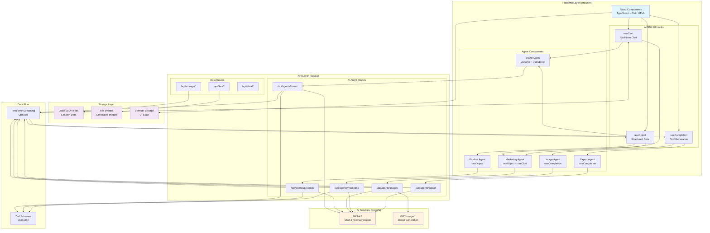

# Storefront Tools - Technical Architecture

## System Overview

Storefront Tools is built as a modern single-page application using Next.js 15 with a microservice-style API architecture. Each AI agent operates independently while sharing data through a centralized storage system.

## Architecture Diagram

### Overall System Architecture (AI SDK UI)

The architecture follows a client-side AI SDK UI approach where React hooks manage AI interactions, streaming, and state:



**Key Architecture Principles:**
1. **Client-Side AI Integration**: All AI interactions managed by AI SDK UI hooks
2. **Real-Time Streaming**: Automatic streaming handled by hooks for responsive UX
3. **Structured Data Flow**: Zod schemas ensure type safety across the entire stack
4. **Stateful Components**: Each agent maintains its own state via hooks
5. **API Route Separation**: Clean separation between AI logic and data management

## Technology Stack
- **Framework**: Next.js 15 with App Router
- **Language**: TypeScript 5.8+
- **UI Elements**: Plain HTML elements only (div, p, h1, h2, form, input, button, etc.)
- **Components**: Basic TypeScript functions returning JSX with HTML elements
- **State Management**: React Server Components + local state
- **Icons**: Basic text-based indicators

### Backend
- **Runtime**: Node.js 18+ with Next.js API routes
- **AI Integration**: Vercel AI SDK
- **Validation**: Zod schemas
- **File Handling**: Native File API + Vercel Blob (future)

### AI Services
- **Client-Side Integration**: AI SDK UI hooks (`useChat`, `useCompletion`, `useObject`) for frontend interactions
- **Text Generation**: OpenAI GPT-4.1 via API routes with streaming responses
- **Image Generation**: OpenAI GPT-Image-1 via API routes
- **Structured Output**: `useObject` hook with real-time streaming of Zod-validated objects
- **Chat Streaming**: `useChat` hook managing conversation state and real-time updates
- **Completion Streaming**: `useCompletion` hook for interactive text generation
- **Agent System**: Specialized prompts handled via API routes with context-aware responses

### Data & Storage
- **Phase 1**: File-based JSON storage in project directory
- **Phase 2**: PostgreSQL + Prisma ORM
- **File Storage**: Local project files → Vercel Blob → S3
- **Caching**: File system cache + Redis (future)

## Data Architecture

### Data Flow (AI SDK UI)
1. **User Input** → AI SDK UI Hook (`useChat`, `useObject`, `useCompletion`)
2. **Hook** → API Route → AI Service (GPT-4.1) → Streaming Response
3. **Streaming Response** → Hook State Management → Real-time UI Updates
4. **Completed Response** → Zod Validation → Local Storage
5. **Storage** → Component State → UI Refresh

### Data Persistence Strategy

#### Phase 1: File-Based Storage
```
/data/sessions/[sessionId]/
├── brand.json           - Brand data
├── products.json        - Product catalog  
├── images.json          - Image metadata
└── design-system.json   - Design system data

/public/generated-assets/[sessionId]/
├── images/              - Generated product images
├── exports/             - Export files (CSV, PDF, etc.)
└── temp/                - Temporary files
```

#### Phase 2: Database Schema
```sql
-- Core Tables
brands (id, name, data, created_at, updated_at)
products (id, brand_id, data, created_at, updated_at)  
images (id, product_id, url, metadata, created_at)
design_systems (id, brand_id, data, created_at, updated_at)
exports (id, brand_id, format, data, created_at)

-- Relationships
products.brand_id → brands.id
images.product_id → products.id
design_systems.brand_id → brands.id
exports.brand_id → brands.id
```

## Agent Architecture (AI SDK UI)

### Hook-Based Agent Pattern
```typescript
// Agent component using AI SDK UI hooks
interface AgentHookConfig {
  api: string  // API endpoint for the agent
  initialMessages?: Message[]
  onFinish?: (message: Message) => void
}

// Brand Agent using useChat hook
const BrandInventorAgent = () => {
  const { messages, input, handleSubmit, isLoading } = useChat({
    api: '/api/agents/brand',
    onFinish: (message) => saveBrandData(message.content)
  })
  
  return (
    <div>
      <form onSubmit={handleSubmit}>
        <input value={input} onChange={handleInputChange} />
        <button type="submit" disabled={isLoading}>
          {isLoading ? 'Generating...' : 'Generate Brand'}
        </button>
      </form>
      <div>
        {messages.map(message => (
          <p key={message.id}>{message.content}</p>
        ))}
      </div>
    </div>
  )
}

// Product Agent using useObject hook  
const ProductDesignerAgent = () => {
  const { object, submit, isLoading } = useObject({
    api: '/api/agents/products',
    schema: ProductCatalogSchema
  })
  
  return (
    <div>
      <button onClick={submit} disabled={isLoading}>
        {isLoading ? 'Generating...' : 'Generate Products'}
      </button>
      {object && (
        <div>
          <h2>Generated Products</h2>
          <ul>
            {object.products.map(product => (
              <li key={product.id}>{product.name}</li>
            ))}
          </ul>
        </div>
      )}
    </div>
  )
}
```

### Brand Inventor Agent (useChat + useObject)
- **Hook**: `useChat` for conversational refinement + `useObject` for structured output
- **API**: `/api/agents/brand` - GPT-4.1 with brand strategy prompts
- **Streaming**: Real-time chat updates with structured data generation
- **Storage**: Automatic persistence via hook callbacks
- **UI**: Basic HTML forms and div elements for display

### Product Designer Agent (useObject + useChat)
- **Hook**: `useObject` for product generation + `useChat` for refinement
- **API**: `/api/agents/products` - GPT-4.1 with product generation prompts
- **Streaming**: Live product catalog streaming with Zod validation
- **Storage**: Real-time product data updates
- **UI**: Plain HTML lists and forms for product management

### Image Generator Agent (useCompletion + Custom Hook)
- **Hook**: `useCompletion` for prompt generation + custom hook for image generation
- **API**: `/api/agents/images` - GPT-4.1 for prompts, GPT-Image-1 for generation
- **Streaming**: Progressive image prompt refinement
- **Storage**: Image metadata and file management
- **UI**: Basic HTML img elements and forms

### Marketing Designer Agent (useObject + useChat)
- **Hook**: `useObject` for design system generation + `useChat` for refinement
- **API**: `/api/agents/marketing` - GPT-4.1 with design system prompts
- **Streaming**: Live design system updates with color/typography streaming
- **Storage**: Design system persistence and asset management
- **UI**: Plain HTML display for design elements

### Catalog Generator Agent (useCompletion + Custom Logic)
- **Hook**: `useCompletion` for export configuration + custom export logic
- **API**: `/api/agents/export` - Data transformation and platform formatting
- **Processing**: Client-side export generation with progress updates
- **Storage**: Export file generation and download management
- **UI**: Basic HTML forms and download links

## API Design (AI SDK UI Compatible)

### AI SDK UI Endpoints
```typescript
// AI SDK UI Hook Endpoints (for useChat, useObject, useCompletion)
POST /api/agents/brand          // useChat & useObject endpoint
POST /api/agents/products       // useObject endpoint  
POST /api/agents/images         // useCompletion endpoint
POST /api/agents/marketing      // useObject & useChat endpoint
POST /api/agents/export         // useCompletion endpoint

// Data Management APIs
GET  /api/storage/read?session=:id&file=:filename
POST /api/storage/write
POST /api/storage/session  
DELETE /api/storage/session

// File Management APIs
POST /api/files/upload
DELETE /api/files/delete
GET  /api/files/download/:id

// Brand Data APIs (called by hook callbacks)
GET  /api/brand/current
PUT  /api/brand/update
DELETE /api/brand/delete

// Product Data APIs (called by hook callbacks)
GET  /api/products/list
POST /api/products/create
PUT  /api/products/:id
DELETE /api/products/:id

// Image Data APIs (called by hook callbacks)
GET  /api/images/list/:productId
POST /api/images/create
DELETE /api/images/:id
PUT  /api/images/:id/approve
```

### Request/Response Patterns (AI SDK UI)
```typescript
// AI SDK UI Hook Request (useChat)
interface ChatRequest {
  messages: Message[]
  data?: Record<string, any>  // Additional context data
}

// AI SDK UI Hook Request (useObject)  
interface ObjectRequest {
  prompt: string
  schema: z.ZodSchema
  context?: any
}

// AI SDK UI Hook Request (useCompletion)
interface CompletionRequest {
  prompt: string
  context?: any
}

// AI SDK UI Streaming Response (handled automatically by hooks)
// The hooks handle streaming internally, no manual parsing needed

// Hook State Interface
interface HookState {
  messages: Message[]        // useChat
  input: string             // useChat
  isLoading: boolean        // All hooks
  error: Error | undefined  // All hooks
  object: T | undefined     // useObject
  completion: string        // useCompletion
}
```

## Security Architecture

### Data Protection
- **Client-side**: Input sanitization + validation
- **API-level**: Rate limiting + request validation  
- **AI-level**: Prompt injection protection
- **Storage**: Data encryption for sensitive fields

### API Security
```typescript
// Rate Limiting
const rateLimits = {
  brand: '10 requests/minute',
  product: '20 requests/minute', 
  image: '5 requests/minute',
  marketing: '10 requests/minute',
  export: '5 requests/minute'
}

// Input Validation
const validateRequest = (schema: ZodSchema) => {
  // Validate against schema
  // Sanitize inputs
  // Check rate limits
}
```

## Performance Architecture

### Optimization Strategies
1. **Code Splitting**: Route-based + component-based
2. **Lazy Loading**: Images + heavy components
3. **Caching**: API responses + generated assets
4. **Streaming**: AI responses + large datasets
5. **Compression**: Images + JSON data

### Performance Targets
- **Initial Load**: < 3 seconds
- **Agent Response**: < 10 seconds for AI generation
- **Image Generation**: < 30 seconds per image
- **Navigation**: < 500ms between pages
- **Storage Operations**: < 100ms

## Scalability Considerations

### Phase 1 Limitations
- Single user per session
- Limited by local file system storage
- No collaborative features
- Data stored locally in project directory
- Manual session management

### Phase 1 Benefits
- Data persists across browser restarts
- Easy to inspect and debug data files
- No external dependencies or services
- Fast read/write operations
- Simple backup and sharing (copy directories)

### Phase 2 Scaling
- Multi-user support with authentication
- Database storage with unlimited capacity
- Real-time collaboration features
- Cloud asset storage and CDN

### Future Scaling
- Microservices architecture
- Kubernetes deployment
- Global CDN for assets
- AI model optimization and caching

## Development Workflow

### Local Development
```bash
# Setup
pnpm install

# Create required directories
mkdir -p data/sessions data/templates
mkdir -p public/generated-assets

# Development
pnpm dev

# Code Quality
pnpm lint
pnpm checktypes
pnpm test

# Build & Deploy
pnpm build
pnpm start
```

### Deployment Strategy
- **Development**: Local development server
- **Staging**: Vercel preview deployments
- **Production**: Vercel production with custom domain

### Monitoring & Observability
- **Frontend**: Error boundaries + logging
- **API**: Request/response logging
- **AI**: Token usage + performance metrics
- **Storage**: Data size + operation metrics

## Integration Points

### External Services
- **OpenAI API**: Text + image generation
- **Vercel Blob**: File storage (Phase 2)
- **Analytics**: Usage tracking (future)
- **CDN**: Asset delivery (future)

### Platform Integrations
- **Shopify**: CSV export format
- **WooCommerce**: XML export format  
- **Magento**: CSV export format
- **Custom**: JSON/XML formats

## Testing Strategy

### Unit Testing
- Utility functions
- Data transformations
- Validation schemas
- Storage operations

### Integration Testing  
- API endpoints
- AI service integration
- Data flow between agents
- Export generation

### End-to-End Testing
- Complete user workflows
- Cross-agent data sharing
- Export file validation
- Performance benchmarks

This technical architecture provides a solid foundation for building a scalable, maintainable, and performant application using plain HTML elements that can grow from a local tool to a comprehensive SaaS platform. 