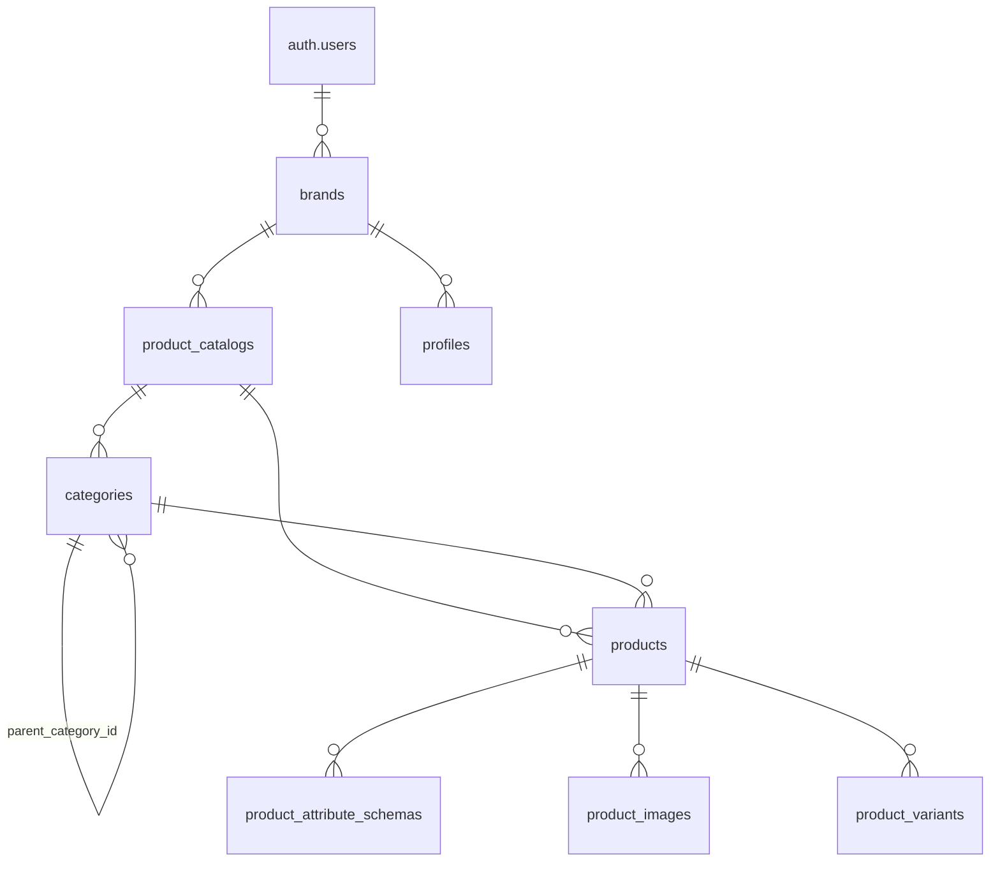

# StoreCraft — Database Schema & ERD  
_Date: 2025-06-14_

---

## 1 · Entity-Relationship Diagram

> **Legend**
> `||--` = 1, `o{` = many, same-table arrow shows self-reference.

---

## 2 · Tables (key columns)

| Table                           | PK                                | Selected Columns & Types                                                                                                        | Notes / Relationships                   |
| ------------------------------- | --------------------------------- | ------------------------------------------------------------------------------------------------------------------------------- | --------------------------------------- |
| **brands**                      | `id bigint`                       | `user_id uuid FK → auth.users.id`   `name text` · `category text`  `status brand_status DEFAULT 'draft'`                  | 1 user ⇒ many brands                    |
| **product\_catalogs**           | `id bigint`                       | `catalog_id text UNIQUE`  `brand_id bigint FK → brands.id`  `name text` · `total_products int`                            | 1 brand ⇒ many catalogs                 |
| **categories**                  | `id bigint`                       | `category_id text UNIQUE`  `catalog_id text FK → product_catalogs.catalog_id`  `parent_category_id text FK (self)`        | Self-nesting tree; belongs to a catalog |
| **products**                    | `id bigint`                       | `catalog_id text FK` · `parent_category_id text FK`  `name/description text` · `status brand_status`  `variant_count int` | Inherits catalog + optional category    |
| **product\_attribute\_schemas** | `id bigint`                       | `product_id bigint FK`  `attribute_key/label text`  `attribute_type enum(select\|text\|…)`                                | Defines custom attr meta per product    |
| **product\_images**             | `id bigint`                       | `product_id bigint FK`  `url text` · `type enum(hero\|gallery…)`  `prompt text` · `seed bigint`                           | Supports multiple angles / variants     |
| **product\_variants**           | `id bigint`                       | `product_id bigint FK`  `sku text UNIQUE` · `price numeric`  `attributes jsonb`                                           | Inventory & pricing per variant         |
| **profiles**                    | `id uuid PK & FK → auth.users.id` | `username text UNIQUE` · `full_name text`                                                                                       | Optional user profile metadata          |
| **waitlist**                    | `id uuid`                         | `email text UNIQUE` · `status enum(active\|…)`                                                                                  | Marketing wait-list sign-ups            |

---

## 3 · Enumerations & Domain Rules

| Enum / Domain         | Values                                                           | Used in                                                                                  |
| --------------------- | ---------------------------------------------------------------- | ---------------------------------------------------------------------------------------- |
| **brand\_status**     | `draft`, `active`, `archived` *etc.*                             | `brands.status`, `products.status`, `product_variants.status`, `product_catalogs.status` |
| **attribute\_type**   | `select`, `text`, `number`, `boolean`, `color`, `url`, `email`   | `product_attribute_schemas.attribute_type`                                               |
| **image type**        | `hero`, `gallery`, `thumbnail`, `lifestyle`, `detail`, `variant` | `product_images.type`                                                                    |
| **inventory\_policy** | `deny`, `continue`                                               | `product_variants.inventory_policy`                                                      |
| **weight\_unit**      | `kg`, `lb`, `g`, `oz`                                            | `product_variants.weight_unit`                                                           |

---

## 4 · Relationship Summary

| Parent → Child                                                               | Cardinality | Cascade Behaviour |
| ---------------------------------------------------------------------------- | ----------- | ----------------- |
| **auth.users** → brands                                                      | 1 : N       | delete = restrict |
| brands → product\_catalogs                                                   | 1 : N       | restrict          |
| product\_catalogs → categories                                               | 1 : N       | restrict          |
| product\_catalogs → products                                                 | 1 : N       | restrict          |
| categories → categories (self)                                               | 1 : N       | restrict          |
| categories → products                                                        | 1 : N       | restrict          |
| products → product\_images / product\_variants / product\_attribute\_schemas | 1 : N       | restrict          |

---

## 5 · Notable Constraints & Defaults

* All main tables include `created_at` & `updated_at` (`timestamptz`, default `now()`).
* Arrays (`text[]`) store tag-like or multi-select values (e.g. `brands.target_interests`).
* JSONB columns (`metadata`, `options`, `attributes`) allow flexible, schema-lite data.
* `product_images.aspect_ratio` auto-computes on insert: `ROUND(width/height, 4)`.

---

## 6 · Row-Level Security (planned)

* **Isolation by `user_id`** — brands, catalogs, and child entities are visible only if `brands.user_id = auth.uid()`.
* **Workspace future-proofing** — schema accommodates a future `workspaces` table; FK would migrate from `user_id` to `workspace_id`.

---

*© 2025 StoreCraft*