# 🏗️ CREATIVE PHASE: ARCHITECTURE DESIGN - Brand Pages Component Architecture & Theming System

**Task:** Level 3 Intermediate Feature - Brand Pages UI/UX Redesign  
**Component:** Dynamic Theming Architecture & Component System  
**Date:** December 15, 2024  

## PROBLEM STATEMENT

The current brand management system lacks a scalable architecture for dynamic theming and responsive component management. Technical requirements include:

- **Dynamic CSS Custom Property Management:** Brand-specific theming without performance impact
- **Responsive Navigation Architecture:** Mobile-first navigation that adapts to brand context
- **Scalable Image Optimization:** Efficient handling of brand assets and logos
- **Type-Safe Theming System:** Brand color validation with TypeScript integration
- **Performance-Optimized Architecture:** Caching strategies and efficient re-rendering

## ARCHITECTURE OPTIONS ANALYSIS

### Option 1: CSS-in-JS Runtime Theming
**Description:** Use Emotion or styled-components for runtime theme injection with brand-specific styling.

**Pros:**
- Full dynamic theming capabilities
- TypeScript integration with theme types
- Component-level theme isolation
- Rich theming API with JavaScript logic

**Cons:**
- Runtime performance overhead for style injection
- Larger bundle size with CSS-in-JS library
- Conflicts with existing PandaCSS system
- Complex migration path from current styling

**Technical Fit:** Low (conflicts with PandaCSS)  
**Complexity:** High  
**Scalability:** Medium  

### Option 2: CSS Custom Properties with Context Providers ⭐ **SELECTED**
**Description:** Extend PandaCSS with CSS custom properties, use React Context for brand theme state management.

**Pros:**
- Native CSS performance with custom properties
- Seamless PandaCSS integration and extension
- TypeScript support with theme token types
- Server-side rendering compatible
- Minimal runtime overhead

**Cons:**
- Limited to CSS custom property capabilities
- Requires careful CSS cascade management
- Brand color validation needs JavaScript layer
- IE11 compatibility concerns (minimal impact)

**Technical Fit:** High (extends existing system)  
**Complexity:** Medium  
**Scalability:** High  

### Option 3: Build-time Theme Generation
**Description:** Generate static CSS files for each brand theme at build time, switch themes via CSS class swapping.

**Pros:**
- Zero runtime performance impact
- Complete CSS optimization and minification
- Simple implementation with class switching
- Full PandaCSS compatibility

**Cons:**
- Build time increases with number of brands
- Static theme limitation (no dynamic brand creation)
- Complex deployment with brand-specific builds
- Limited to predefined brand themes

**Technical Fit:** Medium (limited flexibility)  
**Complexity:** Low  
**Scalability:** Low (static themes only)  

## DECISION RATIONALE

**Selected Option: CSS Custom Properties with Context Providers (Option 2)**

**Key Decision Factors:**
1. **PandaCSS Integration:** Natural extension of existing design system without conflicts
2. **Performance:** Native CSS performance with minimal JavaScript overhead
3. **Flexibility:** Supports dynamic brand creation and real-time theming
4. **Type Safety:** Full TypeScript integration with theme token validation
5. **Maintainability:** Clear separation between theme logic and component logic

## IMPLEMENTATION ARCHITECTURE

### 1. Brand Theme Provider System

```typescript
// Core theme interfaces
interface BrandTheme {
  id: string
  name: string
  colors: {
    primary: string
    secondary?: string
    accent?: string
  }
  logo?: string
  validated: boolean
}

interface BrandThemeContextValue {
  currentTheme: BrandTheme | null
  setTheme: (theme: BrandTheme) => void
  validateTheme: (theme: BrandTheme) => BrandTheme
  isLoading: boolean
}

// React Context implementation
const BrandThemeContext = createContext<BrandThemeContextValue | null>(null)

// Theme provider with CSS custom property management
export function BrandThemeProvider({ brands, children }: BrandThemeProviderProps) {
  const [currentTheme, setCurrentTheme] = useState<BrandTheme | null>(null)
  const [themeCache] = useState(() => new Map<string, BrandTheme>())
  
  // CSS custom property injection
  useEffect(() => {
    if (currentTheme?.validated) {
      document.documentElement.style.setProperty('--brand-primary', currentTheme.colors.primary)
      document.documentElement.style.setProperty('--brand-secondary', currentTheme.colors.secondary || '#1F1F24')
      // Additional custom properties...
    }
  }, [currentTheme])
  
  // Theme validation with accessibility checking
  const validateTheme = useCallback((theme: BrandTheme): BrandTheme => {
    const cachedTheme = themeCache.get(theme.id)
    if (cachedTheme?.validated) return cachedTheme
    
    const validatedColors = {
      primary: validateContrast(theme.colors.primary) ? theme.colors.primary : '#0DF2D9',
      secondary: theme.colors.secondary || '#1F1F24',
      accent: theme.colors.accent || '#F20D92'
    }
    
    const validatedTheme = { ...theme, colors: validatedColors, validated: true }
    themeCache.set(theme.id, validatedTheme)
    return validatedTheme
  }, [themeCache])
  
  return (
    <BrandThemeContext.Provider value={{ currentTheme, setTheme: setCurrentTheme, validateTheme, isLoading: false }}>
      {children}
    </BrandThemeContext.Provider>
  )
}
```

### 2. PandaCSS Extension Architecture

```typescript
// Extended PandaCSS configuration
import { defineConfig } from '@pandacss/dev'

export default defineConfig({
  theme: {
    extend: {
      tokens: {
        colors: {
          // Brand-aware tokens with fallbacks
          brand: {
            primary: { 
              value: 'var(--brand-primary, {colors.cyan.400})',
              description: 'Dynamic brand primary color with fallback'
            },
            secondary: { 
              value: 'var(--brand-secondary, {colors.gray.600})',
              description: 'Dynamic brand secondary color with fallback'
            },
            accent: { 
              value: 'var(--brand-accent, {colors.pink.500})',
              description: 'Dynamic brand accent color with fallback'
            }
          }
        }
      },
      recipes: {
        brandCard: {
          base: {
            borderRadius: '12px',
            border: '1px solid',
            borderColor: 'gray.200',
            transition: 'all 0.2s ease',
            _hover: {
              borderColor: 'brand.primary',
              boxShadow: '0 4px 12px token(colors.brand.primary/15)'
            }
          }
        }
      }
    }
  }
})
```

### 3. Component Architecture System

```mermaid
graph TB
    subgraph "THEME PROVIDER LAYER"
    ThemeProvider["BrandThemeProvider<br/>• CSS Custom Properties<br/>• Theme Validation<br/>• Caching Strategy"]
    ThemeContext["BrandThemeContext<br/>• Theme State<br/>• Validation API<br/>• Loading States"]
    end
    
    subgraph "COMPONENT LAYER"
    BrandCard["BrandCard<br/>• Theme-aware styling<br/>• Responsive layout<br/>• Performance optimized"]
    Navigation["BrandNavigation<br/>• Mobile responsive<br/>• Context awareness<br/>• Touch gestures"]
    Dashboard["BrandDashboard<br/>• Analytics integration<br/>• Theme application<br/>• Data visualization"]
    end
    
    subgraph "UTILITY LAYER"
    ImageOptim["ImageOptimization<br/>• WebP conversion<br/>• Lazy loading<br/>• Responsive sizes"]
    Search["SearchSystem<br/>• Client filtering<br/>• Server fallback<br/>• URL synchronization"]
    Validation["ThemeValidation<br/>• Contrast checking<br/>• Fallback system<br/>• Accessibility compliance"]
    end
    
    ThemeProvider --> ThemeContext
    ThemeContext --> BrandCard
    ThemeContext --> Navigation
    ThemeContext --> Dashboard
    
    BrandCard --> ImageOptim
    Navigation --> Search
    Dashboard --> Validation
    
    style ThemeProvider fill:#4dbb5f,stroke:#36873f,color:white
    style ThemeContext fill:#ffa64d,stroke:#cc7a30,color:white
    style BrandCard fill:#d94dbb,stroke:#a3378a,color:white
    style Navigation fill:#4dbbbb,stroke:#368787,color:white
    style Dashboard fill:#d971ff,stroke:#a33bc2,color:white
```



### 4. Responsive Navigation Architecture

```typescript
// Navigation state management
interface NavigationState {
  isMobile: boolean
  isExpanded: boolean
  currentBrand: Brand | null
  breadcrumbs: BreadcrumbItem[]
}

// Responsive navigation hook
export function useResponsiveNavigation() {
  const [state, setState] = useState<NavigationState>({
    isMobile: false,
    isExpanded: false,
    currentBrand: null,
    breadcrumbs: []
  })
  
  // Breakpoint detection
  useEffect(() => {
    const mediaQuery = window.matchMedia('(max-width: 768px)')
    const handleChange = (e: MediaQueryListEvent) => {
      setState(prev => ({ ...prev, isMobile: e.matches, isExpanded: false }))
    }
    
    mediaQuery.addEventListener('change', handleChange)
    setState(prev => ({ ...prev, isMobile: mediaQuery.matches }))
    
    return () => mediaQuery.removeEventListener('change', handleChange)
  }, [])
  
  return { state, setState }
}

// Navigation component with theme integration
export function BrandNavigation({ brand, children }: BrandNavigationProps) {
  const { currentTheme } = useBrandTheme()
  const { state, setState } = useResponsiveNavigation()
  
  const navigationStyle = css({
    background: state.isMobile ? 'white' : 'gray.50',
    borderRight: state.isMobile ? 'none' : '1px solid token(colors.gray.200)',
    transform: state.isMobile && !state.isExpanded ? 'translateX(-100%)' : 'translateX(0)',
    transition: 'transform 0.3s ease'
  })
  
  return (
    <nav className={navigationStyle}>
      {/* Brand context header with theme accent */}
      <div className={css({ 
        p: 4, 
        borderBottom: '1px solid token(colors.gray.200)',
        background: `linear-gradient(90deg, var(--brand-primary, #0DF2D9) 0%, transparent 100%)`,
        backgroundSize: '4px 100%',
        backgroundRepeat: 'no-repeat'
      })}>
        <h2>{brand.name}</h2>
      </div>
      
      {/* Navigation items */}
      {children}
    </nav>
  )
}
```

### 5. Performance Optimization Architecture

```typescript
// Theme caching with LRU eviction
class ThemeCache {
  private cache = new Map<string, BrandTheme>()
  private maxSize = 50
  
  get(brandId: string): BrandTheme | null {
    const theme = this.cache.get(brandId)
    if (theme) {
      // Move to end (most recently used)
      this.cache.delete(brandId)
      this.cache.set(brandId, theme)
    }
    return theme || null
  }
  
  set(brandId: string, theme: BrandTheme): void {
    if (this.cache.size >= this.maxSize) {
      // Remove least recently used
      const firstKey = this.cache.keys().next().value
      this.cache.delete(firstKey)
    }
    this.cache.set(brandId, theme)
  }
  
  clear(): void {
    this.cache.clear()
  }
}

// Image optimization with lazy loading
export function BrandImage({ 
  src, 
  alt, 
  priority = false,
  sizes = "100vw",
  className 
}: BrandImageProps) {
  return (
    <Image
      src={src}
      alt={alt}
      priority={priority}
      sizes={sizes}
      className={className}
      loading={priority ? 'eager' : 'lazy'}
      quality={85}
      placeholder="blur"
      blurDataURL="data:image/jpeg;base64,/9j/4AAQSkZJRgABAQAAAQ..." // Low-quality placeholder
    />
  )
}

// Virtual scrolling for large brand lists
export function VirtualBrandGrid({ brands }: { brands: Brand[] }) {
  const containerRef = useRef<HTMLDivElement>(null)
  const [visibleRange, setVisibleRange] = useState({ start: 0, end: 20 })
  
  // Implement virtual scrolling logic for 100+ brands
  // Only render visible items + buffer
  
  return (
    <div ref={containerRef} className={css({ height: '600px', overflowY: 'auto' })}>
      {brands.slice(visibleRange.start, visibleRange.end).map(brand => (
        <BrandCard key={brand.id} brand={brand} />
      ))}
    </div>
  )
}
```

### 6. Data Flow Architecture


## VALIDATION AGAINST REQUIREMENTS

✅ **Dynamic CSS Management** - CSS custom properties with React Context state management  
✅ **Responsive Navigation** - Mobile-first architecture with breakpoint detection  
✅ **Scalable Image Optimization** - Next.js Image with lazy loading and responsive sizes  
✅ **Type-Safe Theming** - Full TypeScript integration with validation layer  
✅ **Performance Optimization** - Caching, virtual scrolling, and efficient re-rendering  
✅ **PandaCSS Integration** - Seamless extension of existing design system  
✅ **Accessibility Compliance** - Color contrast validation with fallback system  

## IMPLEMENTATION PHASES

### Phase 1: Foundation (2 days)
- Brand theme provider and context setup
- PandaCSS extension with CSS custom properties
- Basic theme validation system
- TypeScript interfaces and types

### Phase 2: Component Architecture (2 days)
- Responsive navigation component with theme integration
- Brand-aware layout system with mobile optimization
- Image optimization system with lazy loading
- Performance monitoring setup

### Phase 3: Advanced Features (2 days)
- Theme caching with LRU eviction strategy
- Virtual scrolling for large brand lists
- Search and filtering architecture
- Accessibility validation and testing

## TECHNICAL SPECIFICATIONS

### Browser Compatibility
- **Modern Browsers:** Full CSS custom property support
- **Safari 14+:** Complete compatibility
- **Chrome/Firefox/Edge:** Full feature support
- **IE11:** Graceful degradation (fallback colors only)

### Performance Targets
- **Theme Switch Time:** < 100ms
- **Image Load Time:** < 2s for critical assets
- **Bundle Size Impact:** < 10KB additional
- **Memory Usage:** < 50MB for theme cache

### Security Considerations
- **XSS Prevention:** Sanitize all brand-provided content
- **CSS Injection:** Validate custom property values
- **Image Security:** Verify image sources and dimensions
- **Input Validation:** Sanitize theme color values

---

## CREATIVE PHASE COMPLETE ✅

**Architecture design finalized** with implementation-ready specifications for CSS custom properties theming system, responsive component architecture, and performance-optimized brand management interface. 